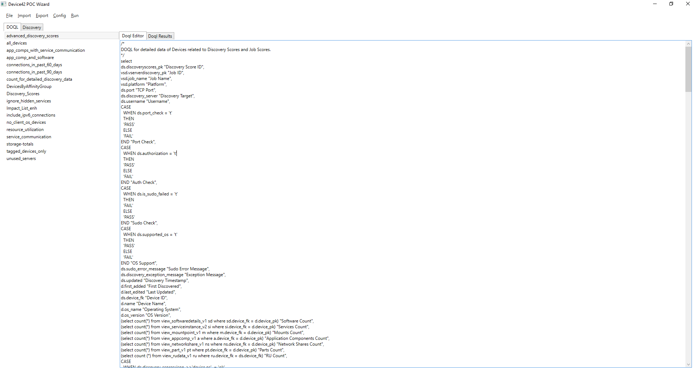

# d42-dotnet
(Unofficial) Device42 Wizard 

# Features
- Browse the Device42 Data Dictionary directly within the app. Search for views and find columns easily.
- Run DOQL queries and view results.
- Export DOQL query results as CSV.
- Create/Edit/Save DOQL queries directly in the tool.
- Post them to your D42 instance.
- Built in DOQL library.
- Fetch latest DOQL from github.
    
# How to use

1. Download and unzip D42.WIZ.zip.
2. (Optional) Edit config.xml to set your default settings.
3. Run the D42.WIZ.exe. It will load the settings in config.xml. If you didn't set any, navigate to Config -> Edit Configuration and fill in config details.
4. Navigate to Import -> Update DOQL Library to fetch most recent DOQL from https://github.com/M6thrXeat/DOQL_scripts_examples/archive/master.zip

Screenshots:

